<p align="center">
  
</p>

<h1 align="center">🔓 DB Cracker v3.1</h1>

<p align="center">
  <strong>ctOS Faculty Database Scanner — Pencarian Data Pendidikan Indonesia</strong>
</p>

<p align="center">
  <a href="https://github.com/el-pablos/DB-Cracker/actions"></a>
  <a href="https://github.com/el-pablos/DB-Cracker/releases/latest"></a>
  
  
  
  
  
</p>

---

## 📖 Deskripsi

**DB Cracker** adalah aplikasi Flutter multi-platform (Android & Web) buat nyari data pendidikan tinggi Indonesia. App ini menggunakan arsitektur **provider chain** yang menghubungkan ke beberapa sumber data publik tanpa membutuhkan API key atau autentikasi. Semua provider core bersifat **free dan no-auth**.

Tema visual ctOS (terinspirasi Watch Dogs) bikin experience pencarian data jadi lebih seru — terminal-style console, animasi hacking, dan dark theme yang konsisten.

### Fitur Utama

- 🔍 **Pencarian Mahasiswa** — cari berdasarkan nama, NIM, atau universitas
- 👨‍🏫 **Pencarian Dosen** — cari berdasarkan nama, NIDN, atau prodi
- 🏫 **Pencarian Perguruan Tinggi** — cari universitas/institut/politeknik
- 📚 **Pencarian Program Studi** — cari jurusan di seluruh Indonesia
- 📊 **Detail Lengkap** — profil mahasiswa, riwayat akademik, profil dosen, penelitian, pengabdian
- 🌐 **Provider Chain** — fallback otomatis ke provider berikutnya saat satu provider gagal
- ⚡ **Smart Cache** — fresh cache (instant), stale cache (fallback saat offline), TTL per tipe data
- 🗺️ **Wilayah Indonesia** — cache provinsi/kabupaten/kecamatan dari wilayah.id
- 🏫 **Sekolah/NPSN Lookup** — cari data sekolah berdasarkan NPSN
- 🔗 **Enrichment Links** — tautan langsung ke GARUDA, RAMA, SINTA untuk riset akademik
- 📖 **Glossary Akademik** — definisi istilah pendidikan dari KBBI + local fallback
- 📰 **Wikipedia Summary** — ringkasan umum PT/wilayah dari Wikipedia Indonesia
- 💼 **MagangHub** — peluang magang dari provider eksternal (optional)
- 🏥 **Health Dashboard** — monitoring status semua provider, latency, dan cache stats
- 🎨 **ctOS Hacker Theme** — UI gelap dengan efek terminal, animasi console, dan visual hacking
- 🔒 **Zero Auth Core** — tidak ada API key yang dibutuhkan untuk fitur utama

---

## 📱 Screenshots

### Home & Search

<p align="center">
  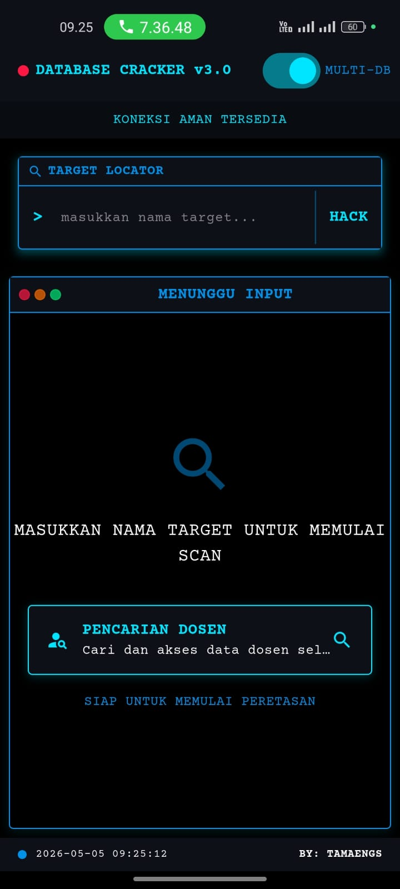
  &nbsp;&nbsp;
  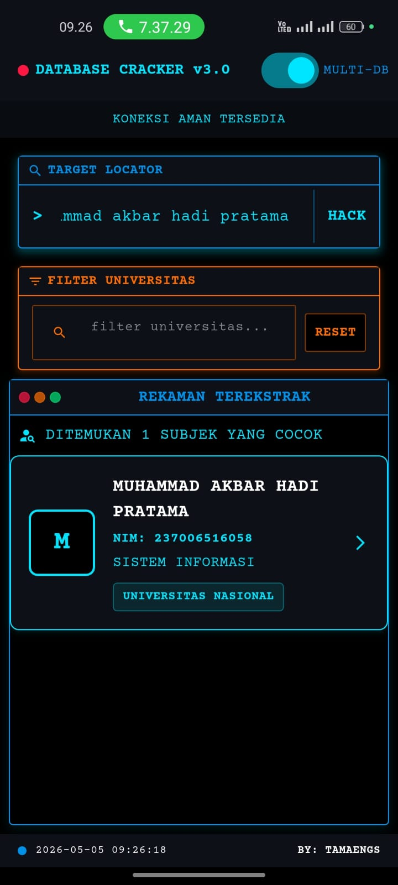
  &nbsp;&nbsp;
  
</p>

<p align="center"><em>Home Screen • Search Results • Splash Screen</em></p>

### Detail Mahasiswa

<p align="center">
  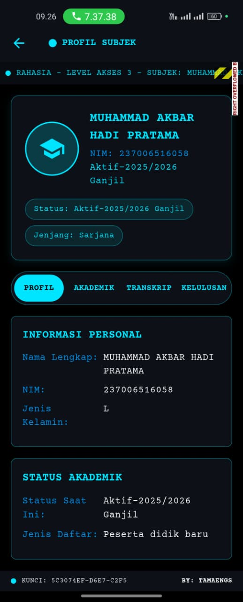
  &nbsp;&nbsp;
  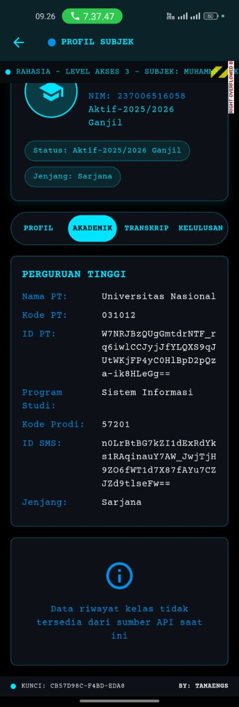
</p>

<p align="center"><em>Tab Profil • Tab Akademik</em></p>

### Pencarian & Detail Dosen

<p align="center">
  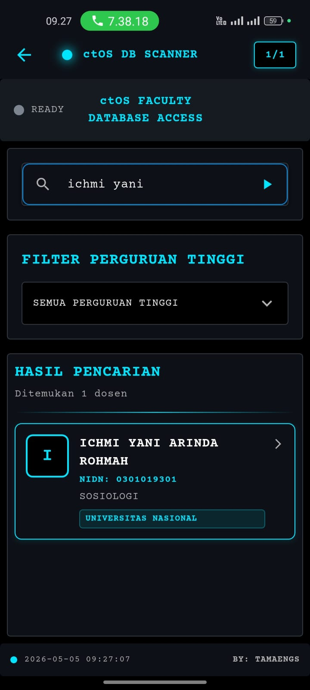
  &nbsp;&nbsp;
  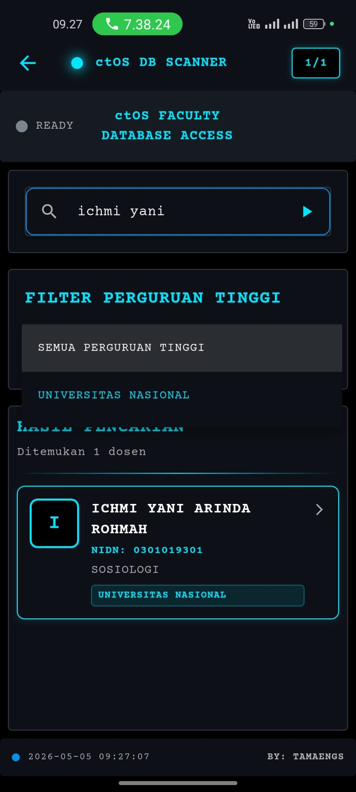
  &nbsp;&nbsp;
  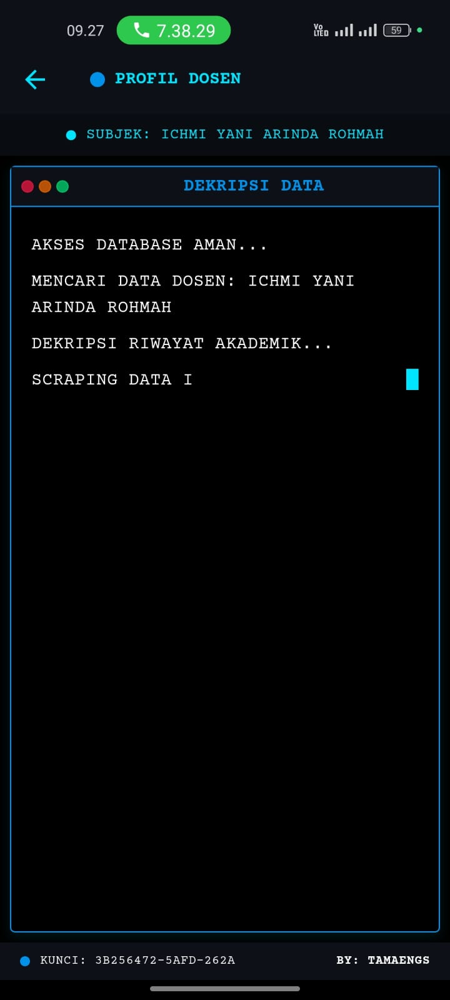
</p>

<p align="center"><em>Search Dosen • Filter PT • Loading Animation</em></p>

<p align="center">
  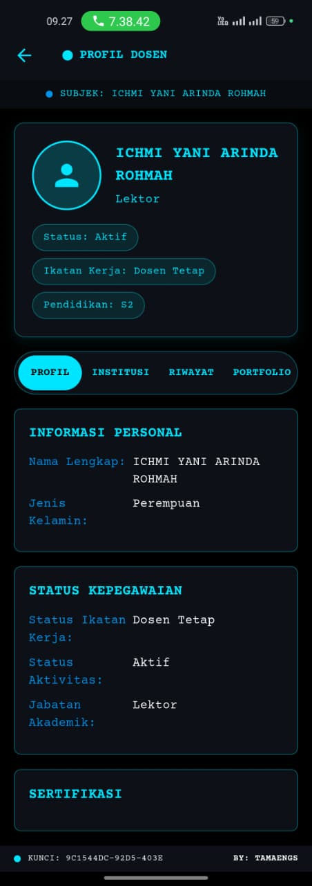
  &nbsp;&nbsp;
  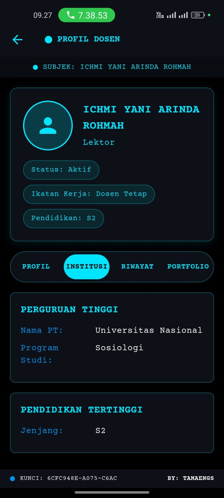
  &nbsp;&nbsp;
  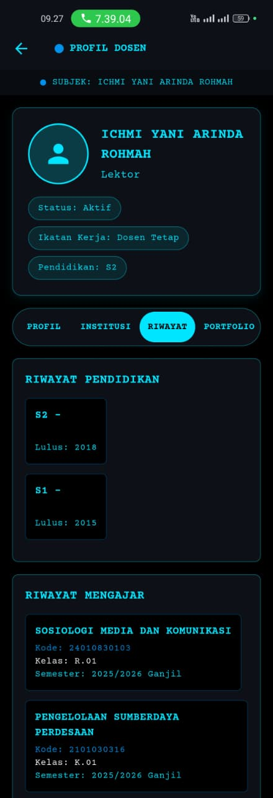
</p>

<p align="center"><em>Profil Dosen • Institusi • Riwayat Pendidikan & Mengajar</em></p>

<p align="center">
  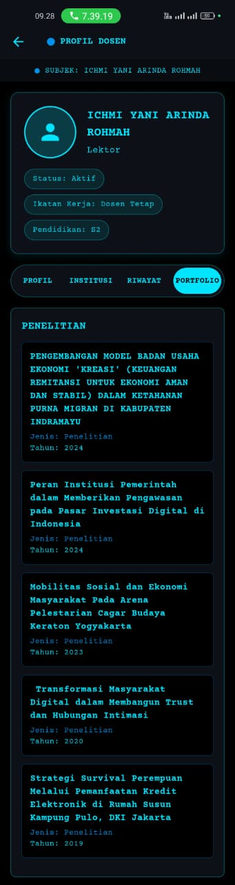
</p>

<p align="center"><em>Portfolio Penelitian Dosen</em></p>

---

## 🏗️ Arsitektur Projek

Projek ini menggunakan arsitektur **layered** dengan pemisahan concern yang jelas:

```
lib/
├── api/                    # Layer API & Network
│   ├── pddikti_api.dart       # Core API client (shared http.Client, caching, proxy)
│   ├── api_factory.dart        # Factory pattern (real API vs mock)
│   ├── multi_api_factory.dart  # Multi-source aggregator
│   └── api_services_integration.dart  # External API integration
├── models/                 # Data Models
│   ├── mahasiswa.dart         # Model Mahasiswa + Detail + Riwayat
│   ├── dosen.dart             # Model Dosen + Detail + Portofolio
│   ├── prodi.dart             # Model Program Studi
│   └── pt.dart                # Model Perguruan Tinggi
├── screens/                # UI Screens
│   ├── home_screen.dart       # Main search screen
│   ├── detail_screen.dart     # Mahasiswa detail (tabbed)
│   ├── dosen_detail_screen.dart    # Dosen detail + portofolio
│   ├── dosen_search_screen_new.dart # Dosen search (ctOS style)
│   ├── prodi_detail_screen.dart    # Detail program studi
│   ├── prodi_search_screen.dart    # Search prodi
│   └── pt_detail_screen.dart       # Detail perguruan tinggi
├── widgets/                # Reusable Widgets
│   ├── terminal_window.dart   # Terminal-style container
│   ├── hacker_search_bar.dart # Search bar dengan "HACK" button
│   ├── hacker_result_item.dart # Result card hacker style
│   ├── ctos_container.dart    # ctOS design system widgets
│   ├── filter_search_bar.dart # Filter universitas
│   └── ...                    # 10+ widget lainnya
├── services/               # Services
│   └── mock_pddikti_service.dart  # Mock data untuk testing
├── utils/                  # Utilities
│   ├── constants.dart         # Colors, strings, dimensions
│   ├── json_utils.dart        # Shared JSON parsing helpers
│   └── screen_utils.dart      # Responsive utilities
├── mixins/                 # Mixins
│   └── console_message_mixin.dart # Console animation mixin
└── main.dart               # App entry point + routing
```

### Design Patterns yang Dipake

| Pattern | Implementasi |
|---------|-------------|
| **Singleton** | `ApiFactory`, `MultiApiFactory`, `ApiServicesIntegration` |
| **Factory** | `ApiFactory` — switch antara real API dan mock |
| **Observer** | `WidgetsBindingObserver` — pause animation saat app di-background |
| **Strategy** | Multi-source search — parallel fetch dari berbagai API |
| **Cache** | In-memory response cache dengan TTL 5 menit, max 50 entries |

---

## 🔄 Flowchart Pencarian

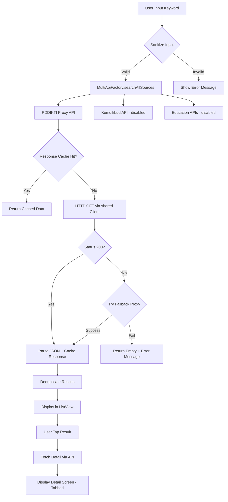

---

## 🔌 API Architecture

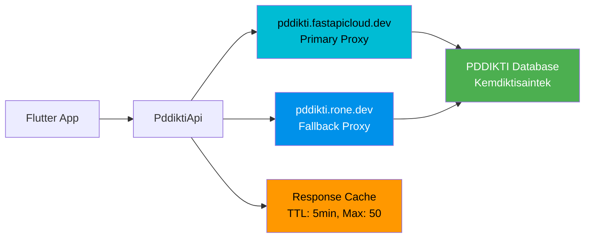

### Endpoint Mapping

| Fungsi | Endpoint |
|--------|----------|
| Search Mahasiswa | `GET /api/search/mhs/{keyword}/` |
| Search Dosen | `GET /api/search/dosen/{keyword}/` |
| Search PT | `GET /api/search/pt/{keyword}/` |
| Search Prodi | `GET /api/search/prodi/{keyword}/` |
| Detail Mahasiswa | `GET /api/mhs/detail/{id}/` |
| Detail Dosen | `GET /api/dosen/profile/{id}/` |
| Detail PT | `GET /api/pt/detail/{id}/` |
| Detail Prodi | `GET /api/prodi/detail/{id}/` |
| Riwayat Studi Dosen | `GET /api/dosen/study-history/{id}/` |
| Riwayat Mengajar | `GET /api/dosen/teaching-history/{id}/` |
| Penelitian Dosen | `GET /api/dosen/penelitian/{id}/` |
| Pengabdian Dosen | `GET /api/dosen/pengabdian/{id}/` |

---

## 🔌 Provider Registry (No-Auth)

Semua provider core tidak membutuhkan API key, OAuth, atau autentikasi apapun.

| Provider | Jenis | Auth | Dipakai untuk | Mode |
|----------|-------|------|---------------|------|
| pddikti.fastapicloud.dev | PDDIKTI | no-auth | search/detail mahasiswa, dosen, PT, prodi | core primary |
| pddikti.rone.dev | PDDIKTI | no-auth | fallback PDDIKTI | core fallback |
| wilayah.id | Wilayah | no-auth | provinsi, kabupaten, kecamatan, desa | core primary |
| emsifa (GitHub Pages) | Wilayah | no-auth | fallback wilayah (static JSON) | core fallback |
| api.fazriansyah.eu.org | Sekolah | no-auth | lookup NPSN | optional |
| Wikipedia Indonesia | Summary | no-auth | ringkasan umum PT/wilayah | optional |
| KBBI API + local | Glossary | no-auth | definisi istilah akademik | optional |
| MagangHub | Career | no-auth | peluang magang | optional |
| GARUDA | External Link | no-auth | tautan pencarian publikasi | deep-link |
| RAMA | External Link | no-auth | tautan pencarian repository | deep-link |
| SINTA | External Link | no-auth | tautan pencarian profil riset | deep-link |

> **Catatan**: GARUDA, RAMA, dan SINTA bukan API provider — hanya deep-link ke portal resmi. Tidak ada scraping otomatis.

---

## 🗺️ Wilayah Indonesia Cache

Data wilayah di-cache agresif karena jarang berubah (TTL 30 hari fresh, 180 hari stale). Provider chain:

1. **wilayah.id** (primary) — 38 provinsi terbaru termasuk pemekaran Papua
2. **emsifa** (fallback) — static JSON di GitHub Pages, 34 provinsi

Fitur:
- Normalisasi otomatis UPPERCASE → Title Case
- Support field `code`/`id`/`kode` dan `name`/`nama`
- Pencarian provinsi case-insensitive
- Cache persistent antar session

---

## 🏫 Sekolah/NPSN Lookup

Fitur tambahan untuk lookup data sekolah berdasarkan NPSN (Nomor Pokok Sekolah Nasional):
- Validasi input: harus numeric, minimal 6 digit
- Parser defensif: support multiple candidate field names
- Cache 7 hari fresh, 30 hari stale
- Graceful unavailable jika provider mati

---

## 🔗 Enrichment Akademik

Tautan langsung ke portal riset resmi — **bukan scraper**, hanya URL builder:

- **GARUDA** → Pencarian publikasi ilmiah dosen
- **RAMA** → Pencarian repository tugas akhir/tesis/disertasi
- **SINTA** → Pencarian profil riset dan metrik dosen

Label UI selalu jelas: "Buka pencarian di portal eksternal" — tidak mengklaim data berhasil diambil.

---

## 🏥 Health Dashboard

Monitor status semua provider real-time:
- Status: healthy / degraded / rateLimited / timeout / unavailable
- Latency per provider (ms)
- Cache statistics (fresh/stale/expired entries)
- Tombol refresh manual
- App version info

Akses via tombol ❤️ di AppBar home screen atau route `/health`.

---

## 🔒 Keamanan & Privasi Data

- Tidak ada API key di source code
- Tidak ada bulk export data mahasiswa/dosen
- Minimal keyword 3 karakter untuk search
- Debounce search input
- Cache hanya data publik, bisa di-clear
- Attribution sumber data di README
- Mock data tidak tampil sebagai live data di production
- `.gitignore` melindungi semua file sensitif

---

## ⚡ Performance Optimizations

Versi 3.0 udah di-overhaul total dari sisi performa:

| Optimisasi | Sebelum | Sesudah | Impact |
|-----------|---------|---------|--------|
| HTTP Client | New connection per request | Shared `http.Client` (keep-alive) | ~30% faster |
| Response Cache | Tidak ada | In-memory (5min TTL, 50 entries) | Instant repeat search |
| JSON Decode | Double decode di 6 methods | Single `_decodeResponse` | 50% less CPU |
| Dosen Profile | Sequential 3 endpoint (45s worst) | Single proxy endpoint (8s max) | 5x faster |
| List Extraction | 15x redundant double `is List` | Generic `_extractList` helper | Cleaner code |
| Data Fetch | 11x copy-paste methods | Generic `_fetchDosenList<T>` | -300 lines |
| Animation | Runs forever (battery drain) | Pause on background via Observer | Battery savings |
| Filter UI | 800ms blocking dialog | Instant setState | No UX delay |

---

## 🛠️ Tech Stack

| Teknologi | Versi | Fungsi |
|-----------|-------|--------|
| Flutter | 3.27.x | UI Framework |
| Dart | ≥3.7.0 | Programming Language |
| Provider | ^6.0.5 | State Management (DI) |
| http | ^0.13.5 | HTTP Client |
| url_launcher | ^6.1.11 | Open external URLs |
| intl | ^0.18.1 | Internationalization |

---

## 🚀 Installation & Setup

### Prerequisites
- Flutter SDK ≥3.7.0
- Dart SDK ≥3.7.0
- Android SDK (untuk build Android)
- Chrome (untuk build Web)

### Clone & Run

```bash
# Clone repo
git clone https://github.com/el-pablos/DB-Cracker.git
cd DB-Cracker

# Install dependencies
flutter pub get

# Run di Android device
flutter run -d <device-id>

# Run di Chrome (web)
flutter run -d chrome

# Build release APK
flutter build apk --release

# Build web
flutter build web --release
```

### Run Tests

```bash
# Unit tests
flutter test

# Analyze code
flutter analyze
```

---

## 🧪 Testing

Projek ini punya **99 unit tests** yang cover:

| Category | Tests | Coverage |
|----------|-------|----------|
| API Layer | 11 | Factory, singleton, integration |
| Models | 32 | JSON parsing, null safety, edge cases |
| Utils | 19 | Constants, JSON helpers |
| Widgets | 37 | Render, interaction, state |
| **Total** | **99** | **100% passed** ✅ |

```bash
$ flutter test
00:03 +99: All tests passed!
```

---

## 📋 CI/CD Pipeline

Setiap push ke `main` otomatis trigger:

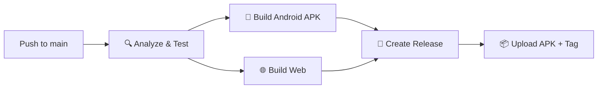

- ✅ Auto analyze (lint + type check)
- ✅ Auto test (99 unit tests)
- ✅ Auto build APK + Web
- ✅ Auto create GitHub Release dengan changelog
- ✅ Auto version tagging dari `pubspec.yaml`

---

## 🔒 Security Notes

- Tidak ada API key atau secret yang di-hardcode
- Input user di-sanitize sebelum dikirim ke API
- Semua koneksi via HTTPS
- Response cache hanya di memory (tidak persist ke disk)
- `.gitignore` di-hardcode untuk block semua file sensitif

---

## 📊 Statistik Projek

| Metric | Value |
|--------|-------|
| Total Dart Files | 38 |
| Lines of Code (lib/) | ~5,700 |
| Unit Tests | 99 |
| Test Pass Rate | 100% |
| APK Size (release) | 46.7 MB |
| Min Android SDK | API 21 (Android 5.0) |
| Target Android SDK | API 34 (Android 14) |
| Flutter Analyze Issues | 0 errors, 0 warnings |

---

## 👨‍💻 Kontributor

<table>
  <tr>
    <td align="center">
      <a href="https://github.com/el-pablos">
        
        <br />
        <sub><b>Tama El Pablo</b></sub>
      </a>
      <br />
      <sub>Creator & Maintainer</sub>
    </td>
  </tr>
</table>

---

## 📄 License

Projek ini dibuat untuk keperluan edukasi dan riset. Data yang ditampilkan bersumber dari PDDIKTI (Pangkalan Data Pendidikan Tinggi) yang merupakan data publik.

---

## 🙏 Credits

- **PDDIKTI** — Sumber data pendidikan tinggi Indonesia
- **[ridwaanhall/api-pddikti](https://github.com/ridwaanhall/api-pddikti)** — Proxy API yang reliable
- **Flutter** — UI framework
- **Watch Dogs (Ubisoft)** — Inspirasi tema ctOS

---

---

## ⚠️ Disclaimer & Etika Penggunaan Data

DB-Cracker menggunakan data publik dari PDDIKTI dan sumber terbuka lainnya. Aplikasi ini dibuat untuk keperluan edukasi dan riset, bukan untuk:
- Stalking atau doxxing
- Scraping massal data pribadi
- Harvesting data untuk keperluan komersial tanpa izin
- Bypass proteksi atau rate limit provider

Gunakan aplikasi ini secara bertanggung jawab. Hormati privasi data dan rate limit provider.

---

## 🔧 Troubleshooting

| Masalah | Solusi |
|---------|--------|
| API tidak merespons | Cek Health Dashboard, provider mungkin sedang down |
| Data kosong setelah search | Pastikan keyword minimal 3 karakter |
| SSL error di Android | App sudah menggunakan proxy dengan proper SSL |
| CORS error di web | Normal — beberapa API tidak support CORS dari browser |
| Cache stale warning | Data dari cache lama, refresh manual atau tunggu TTL |
| Build APK gagal | Pastikan Android SDK terinstall dan `flutter doctor` clean |

---

## 🗺️ Roadmap

- [ ] Persistent cache (Hive) untuk offline mode penuh
- [ ] Filter wilayah dropdown di search PT/Prodi
- [ ] Integration test E2E dengan Playwright
- [ ] Dark/light theme toggle
- [ ] Export hasil pencarian ke PDF
- [ ] Backend gateway untuk enrichment GARUDA/SINTA/RAMA yang lebih dalam
- [ ] Statistik agregat dari data PDDIKTI (jumlah mahasiswa per provinsi, dll)
- [ ] Push notification untuk update status provider

## 📊 Testing & Quality

Projek ini memiliki **180 unit tests** yang mencakup seluruh modul:

| Category | Tests | Coverage |
|----------|-------|----------|
| Provider Chain | 10 | Fallback, timeout, cache, disabled provider |
| Cache Store | 10 | Fresh, stale, expired, eviction, prefix clear |
| Wilayah Service | 9 | Parser, fallback, cache, search |
| Sekolah/NPSN | 9 | Validation, parser, cache, unavailable |
| External Links | 8 | URL encoding, GARUDA/RAMA/SINTA builders |
| Health Service | 8 | Healthy, degraded, timeout, rateLimited |
| Provider Registry | 9 | byKind, byId, core, external, unique IDs |
| DataResult | 5 | Live, cached, stale, sourceLabel |
| Wikipedia/KBBI/MagangHub | 13 | Parser, cache, fallback, validation |
| Models (Mahasiswa/Dosen/PT/Prodi) | 48 | JSON parsing, null safety, edge cases |
| Widgets | 37 | Render, interaction, state |
| Utils | 14 | Constants, JSON helpers |
| **Total** | **180** | **100% passed** ✅ |

Semua test menggunakan mock HTTP client — tidak ada test yang memukul API live secara default. Ini memastikan test deterministic dan bisa jalan di CI tanpa internet.

```bash
$ flutter test
00:07 +180: All tests passed!
```

### Cara Menjalankan Test

```bash
# Unit tests (semua)
flutter test

# Test spesifik modul
flutter test test/api/providers/
flutter test test/cache/
flutter test test/wilayah/
flutter test test/sekolah/
flutter test test/enrichment/
flutter test test/health/

# Analyze (zero errors, zero warnings)
flutter analyze
```

---

<p align="center">
  <strong>Made with ☕ by <a href="https://github.com/el-pablos">Tamaengs</a></strong>
</p>

<p align="center">
  
  
  
</p>
