# DB Cracker — PDDIKTI Data Explorer


> Aplikasi Flutter untuk eksplorasi data pendidikan tinggi Indonesia secara real-time. Mengakses data dari PDDIKTI (Pangkalan Data Pendidikan Tinggi), BNPB, Bank Indonesia, dan berbagai sumber open data pemerintah Indonesia.

---

## Daftar Isi

- [Tentang Projek](#tentang-projek)
- [Fitur Utama](#fitur-utama)
- [Screenshots](#screenshots)
- [Arsitektur](#arsitektur)
- [Tech Stack](#tech-stack)
- [Diagram Arsitektur](#diagram-arsitektur)
- [Flowchart Pencarian](#flowchart-pencarian)
- [Instalasi & Setup](#instalasi--setup)
- [Struktur Folder](#struktur-folder)
- [API Endpoints](#api-endpoints)
- [Testing](#testing)
- [CI/CD Pipeline](#cicd-pipeline)
- [Kontributor](#kontributor)
- [Lisensi](#lisensi)

---

## Tentang Projek

**DB Cracker** adalah aplikasi mobile dan web yang dibangun dengan Flutter untuk mengeksplorasi data pendidikan tinggi Indonesia. Aplikasi ini mengakses data dari berbagai sumber API pemerintah Indonesia secara real-time, termasuk:

- **PDDIKTI** — Data mahasiswa, dosen, program studi, dan perguruan tinggi
- **BNPB InaRISK** — Indeks Risiko Bencana Indonesia (IRBI)
- **Bank Indonesia / Frankfurter** — Kurs mata uang real-time
- **Kemnaker** — Data Upah Minimum Provinsi (UMP) 2025
- **data.go.id (CKAN)** — Dataset publik Indonesia
- **NEMESIS** — Data pengadaan barang/jasa pemerintah

Aplikasi ini didesain dengan UI modern dark-theme (Neo-Violet) yang elegan dan responsif, mendukung mode multi-source untuk menggabungkan data dari berbagai API sekaligus.

---

## Fitur Utama

### Pencarian Mahasiswa
- Pencarian multi-source dari PDDIKTI dan sumber lain
- Detail lengkap: biodata, akademik, riwayat semester
- Enrichment otomatis untuk IPK, SKS, dan tahun masuk dari riwayat semester
- Filter universitas dengan dropdown search

### Pencarian Dosen
- Data profil dosen lengkap dari PDDIKTI
- Riwayat mengajar, penelitian, pengabdian, karya ilmiah
- Jabatan fungsional dan penugasan

### Program Studi & Perguruan Tinggi
- Pencarian prodi dengan detail akreditasi
- Informasi perguruan tinggi lengkap

### Economy Dashboard
- Kurs USD/IDR real-time dari Frankfurter API
- Data UMP 2025 (Top 10 provinsi tertinggi)
- Sumber: Keputusan Gubernur masing-masing provinsi

### Disaster Dashboard
- Cek risiko bencana berdasarkan koordinat GPS
- **IRBI (Indeks Risiko Bencana Indonesia)** — Top 10 kabupaten berisiko tinggi
- Data real-time dari BNPB InaRISK API

### Procurement Dashboard
- Data pengadaan barang/jasa pemerintah
- Analisis risiko dan potensi pemborosan
- Sumber: NEMESIS API

### Statistics Dashboard
- Pencarian dataset publik dari data.go.id (CKAN)
- Metadata, format, dan organisasi penyedia data

### Health Monitor
- Status kesehatan semua API provider
- Latency monitoring dan cache statistics

---

## Screenshots

| Home Screen | Pencarian Mahasiswa | Detail Mahasiswa |
|:-----------:|:-------------------:|:----------------:|
| 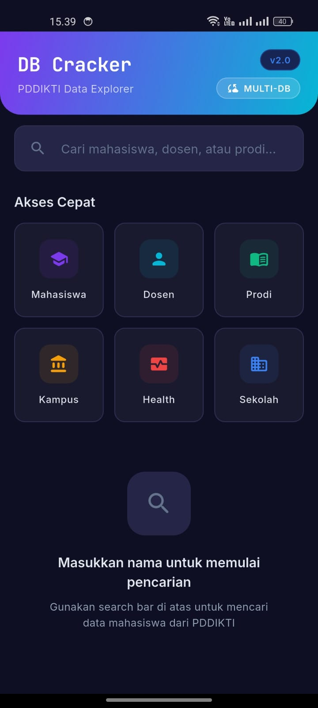 | 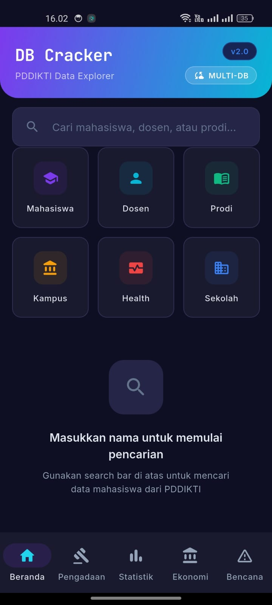 | 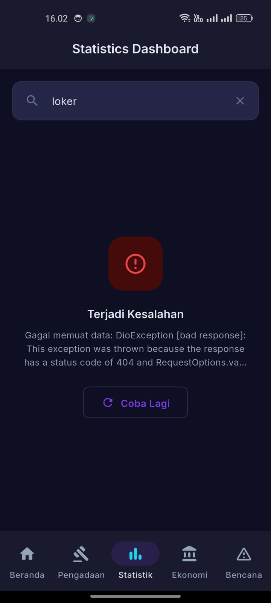 |

| Biodata Tab | Akademik Tab | Riwayat Tab |
|:-----------:|:------------:|:-----------:|
| 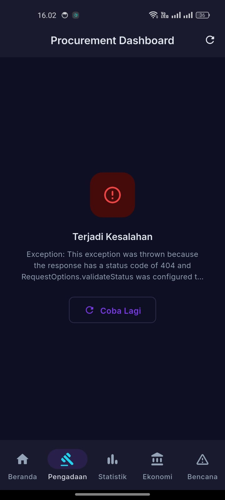 | 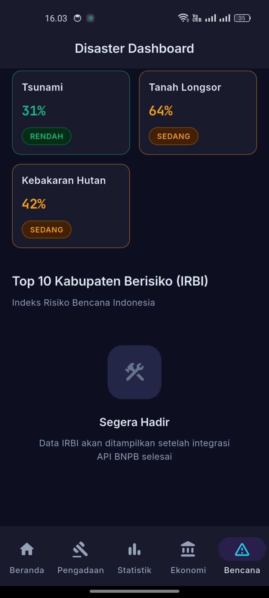 | 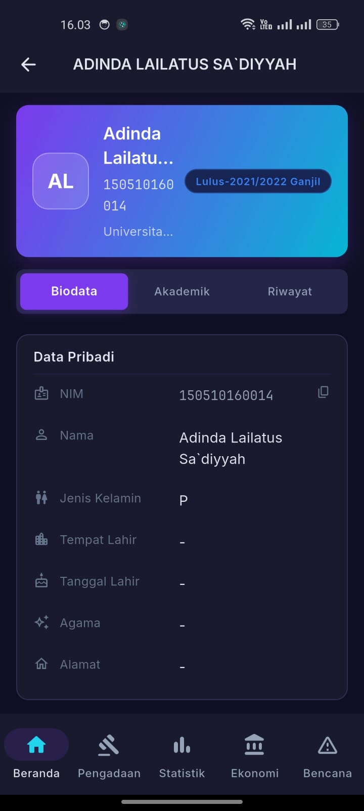 |

| Economy Dashboard | Disaster/IRBI | Filter Universitas |
|:-----------------:|:-------------:|:------------------:|
| 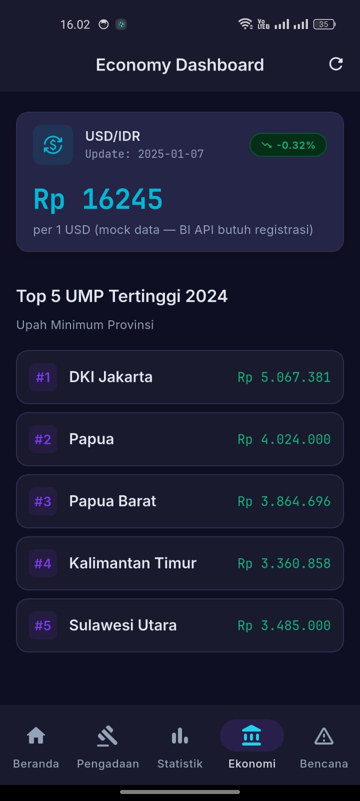 | 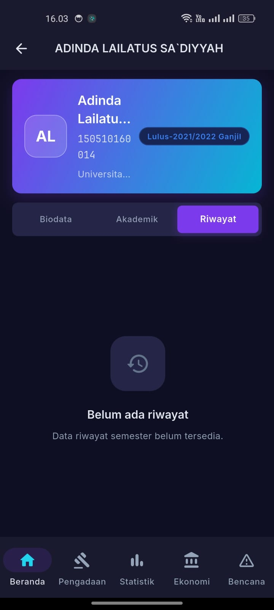 | 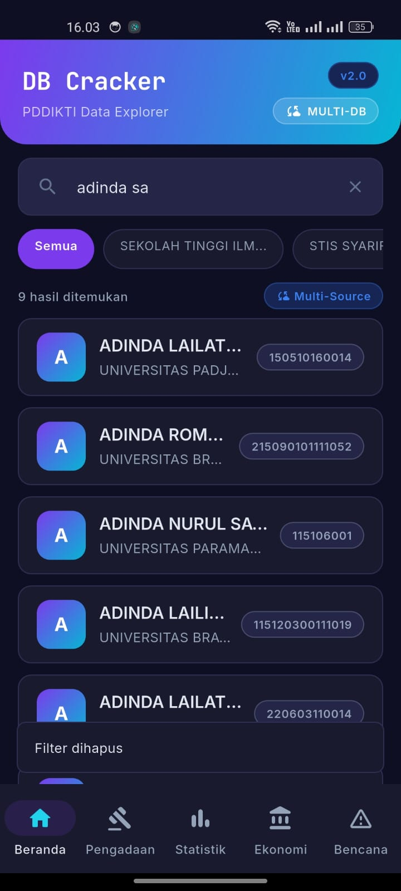 |

---

## Arsitektur

Projek ini menggunakan arsitektur **Clean Architecture** yang dimodifikasi untuk Flutter, dengan pemisahan yang jelas antara:

1. **Presentation Layer** — Screens, Widgets, State Management (Riverpod + Provider)
2. **Domain Layer** — Models, Repository Interfaces
3. **Data Layer** — API Factories, Remote Datasources, Cache

### Pola Desain yang Digunakan

- **Factory Pattern** — `ApiFactory` dan `MultiApiFactory` untuk abstraksi sumber data
- **Provider Chain** — Fallback otomatis antar API provider jika satu gagal
- **Singleton** — Instance tunggal untuk API factories
- **Repository Pattern** — Pemisahan data source dari business logic
- **Observer Pattern** — Riverpod untuk reactive state management

### State Management

- **Riverpod** — Untuk fitur-fitur baru (Economy, Disaster, Statistics, Procurement)
- **Provider (legacy)** — Untuk fitur pencarian mahasiswa/dosen yang sudah ada
- **FutureBuilder** — Untuk async data fetching di detail screens

---

## Tech Stack

| Kategori | Teknologi |
|----------|-----------|
| Framework | Flutter 3.27+ (Dart 3.6+) |
| State Management | Riverpod 2.x + Provider |
| Routing | go_router |
| HTTP Client | http + dio |
| Caching | In-memory cache store custom |
| UI | Material 3 + Custom Neo-Violet Design System |
| Testing | flutter_test (435 unit tests) |
| CI/CD | GitHub Actions |
| Rendering | Impeller (Vulkan) |

---

## Diagram Arsitektur

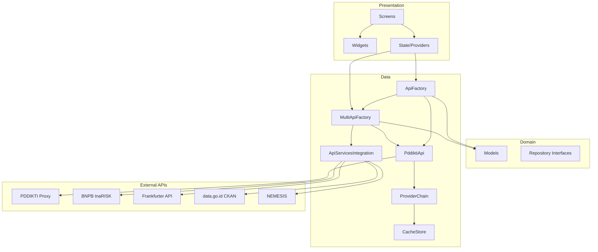

---

## Flowchart Pencarian

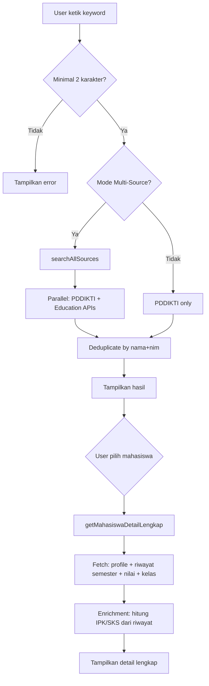

---

## Instalasi & Setup

### Prerequisites

- Flutter SDK 3.27+
- Dart SDK 3.6+
- Android SDK (untuk build Android)
- Java 17 (untuk Gradle)

### Langkah Instalasi

```bash
# Clone repository
git clone https://github.com/tamaengs/DB-Cracker.git
cd DB-Cracker

# Install dependencies
flutter pub get

# Jalankan di device/emulator
flutter run

# Build APK release
flutter build apk --release --split-per-abi

# Build Web
flutter build web --release --web-renderer canvaskit
```

### Konfigurasi

Tidak perlu API key atau konfigurasi tambahan. Semua API yang digunakan adalah **free dan public** tanpa autentikasi:

- PDDIKTI Proxy: `https://pddikti.fastapicloud.dev/api/`
- Frankfurter: `https://api.frankfurter.app/`
- BNPB InaRISK: `https://inarisk.bnpb.go.id/api/`
- data.go.id: `https://data.go.id/api/3/action/`

---

## Struktur Folder

```
lib/
├── api/                    # API layer
│   ├── api_factory.dart    # Main API factory (singleton)
│   ├── multi_api_factory.dart  # Multi-source aggregator
│   ├── pddikti_api.dart    # PDDIKTI API implementation
│   ├── providers/          # Provider chain & registry
│   ├── cache/              # In-memory cache system
│   ├── enrichment/         # External links enrichment
│   ├── health/             # Health check service
│   ├── sekolah/            # Sekolah lookup API
│   └── wilayah/            # Wilayah (region) API
├── core/                   # Core utilities
│   ├── router/             # go_router configuration
│   ├── responsive/         # Adaptive scaffold
│   ├── error/              # Exception classes
│   └── network/            # Network info
├── features/               # Feature modules (Clean Architecture)
│   ├── economy/            # Economy dashboard (UMP, kurs)
│   ├── disaster/           # Disaster dashboard (IRBI, risk)
│   ├── statistics/         # Statistics (CKAN datasets)
│   └── procurement/        # Procurement (NEMESIS)
├── models/                 # Data models
│   ├── mahasiswa.dart      # Mahasiswa & MahasiswaDetail
│   ├── dosen.dart          # Dosen & DosenDetail
│   ├── prodi.dart          # Program Studi
│   └── pt.dart             # Perguruan Tinggi
├── screens/                # Screen widgets
│   ├── home_screen.dart    # Home + search
│   ├── detail_screen.dart  # Mahasiswa detail (3 tabs)
│   ├── dosen_search_screen_new.dart
│   ├── dosen_detail_screen.dart
│   ├── prodi_search_screen.dart
│   ├── prodi_detail_screen.dart
│   ├── pt_detail_screen.dart
│   ├── health_screen.dart
│   └── sekolah_screen.dart
├── theme/                  # Design system
│   ├── app_colors.dart     # Neo-Violet color palette
│   ├── app_typography.dart # Typography scale
│   ├── app_spacing.dart    # Spacing & radius tokens
│   ├── app_gradients.dart  # Gradient definitions
│   └── app_theme.dart      # ThemeData configuration
├── widgets/                # Reusable widgets
│   ├── core/               # NeoCard, NeoBadge
│   ├── data/               # NeoDataRow, NeoStatCard
│   ├── feedback/           # NeoSkeleton, NeoEmpty, NeoError
│   ├── navigation/         # NeoQuickAction, NeoTabBar
│   └── search/             # NeoSearchBar
├── services/               # Mock services
├── utils/                  # Constants, helpers
└── main.dart               # App entry point
```

---

## API Endpoints

### PDDIKTI (via Proxy)

| Endpoint | Deskripsi |
|----------|-----------|
| `GET /mhs/search/{keyword}` | Cari mahasiswa |
| `GET /mhs/detail/{id}/` | Detail mahasiswa |
| `GET /mhs/riwayat_semester/{id}/` | Riwayat semester |
| `GET /mhs/riwayat_nilai/{id}/` | Riwayat nilai |
| `GET /mhs/riwayat_kelas/{id}/` | Riwayat kelas |
| `GET /dosen/search/{keyword}` | Cari dosen |
| `GET /dosen/profile/{id}/` | Profil dosen |
| `GET /prodi/search/{keyword}` | Cari prodi |
| `GET /pt/search/{keyword}` | Cari perguruan tinggi |

### External APIs

| API | Endpoint | Deskripsi |
|-----|----------|-----------|
| Frankfurter | `GET /latest?from=USD&to=IDR` | Kurs real-time |
| BNPB InaRISK | `GET /api/irbi?tahun=2024` | Data IRBI |
| BNPB InaRISK | `GET /api/risk?lat=&lon=` | Risk score |
| data.go.id | `GET /api/3/action/package_search` | Dataset search |
| NEMESIS | `GET /api/bootstrap` | Procurement data |

---

## Testing

Projek ini memiliki **435 unit tests** yang mencakup:

- Model parsing & serialization
- API factory logic
- Provider chain & cache
- Widget rendering
- Feature modules (Economy, Disaster, Statistics, Procurement)
- Health service
- Utility functions

```bash
# Jalankan semua tests
flutter test

# Jalankan dengan coverage
flutter test --coverage

# Jalankan test spesifik
flutter test test/models/mahasiswa_test.dart
```

### Test Results

```
00:30 +435: All tests passed!
```

---

## CI/CD Pipeline

Pipeline otomatis berjalan di GitHub Actions setiap push ke `main`:

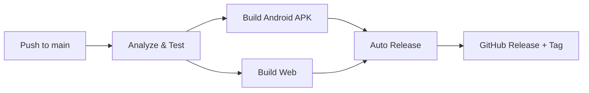

### Fitur CI/CD:
- **Auto-analyze** — Flutter analyze pada setiap push/PR
- **Auto-test** — Jalankan 435 unit tests
- **Auto-build** — Build APK (split per ABI) dan Web
- **Auto-release** — Buat GitHub Release otomatis dengan versioning increment
- **Auto-tag** — Tag version otomatis (v3.0.x)

---

## Kontributor

<table>
  <tr>
    <td align="center">
      <a href="https://github.com/tamaengs">
        
        <br />
        <sub><b>Tama El Pablo</b></sub>
      </a>
      <br />
      <sub>Lead Developer</sub>
    </td>
  </tr>
</table>

---

## Statistik Projek

| Metrik | Nilai |
|--------|-------|
| Total Files | 80+ Dart files |
| Lines of Code | 15,000+ |
| Unit Tests | 435 |
| Test Pass Rate | 100% |
| API Sources | 6 (PDDIKTI, BNPB, BI, Kemnaker, CKAN, NEMESIS) |
| Screens | 10+ |
| Widgets | 20+ reusable components |
| Features | 5 dashboard modules |

---

## Changelog (Recent)

| Commit | Deskripsi |
|--------|-----------|
| `9a9372a` | Improve CI/CD pipeline dengan auto-release |
| `4b468f0` | Ubah filter universitas ke dropdown search |
| `ee0ab01` | Implementasi tab riwayat pendidikan lengkap |
| `0676a3e` | Enrichment biodata dari riwayat semester |
| `b0aa492` | Implementasi IRBI penuh dari BNPB InaRISK |
| `5fec886` | UMP 2025 realtime dari Frankfurter API |
| `58c95b1` | Fix IME keyboard spam loop |
| `132a496` | Fix crash navigation go_router + NDK update |

---

## Lisensi

MIT License - Lihat file [LICENSE](LICENSE) untuk detail.

---

<p align="center">
  <b>DB Cracker v3.0.0</b> — Built with Flutter & Dart
  <br/>
  <sub>Data pendidikan Indonesia di ujung jari kamu.</sub>
</p>
