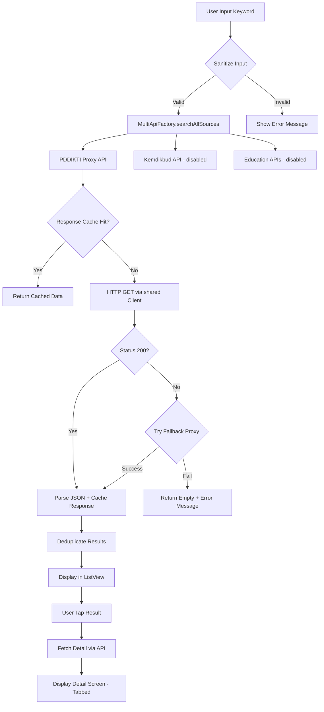
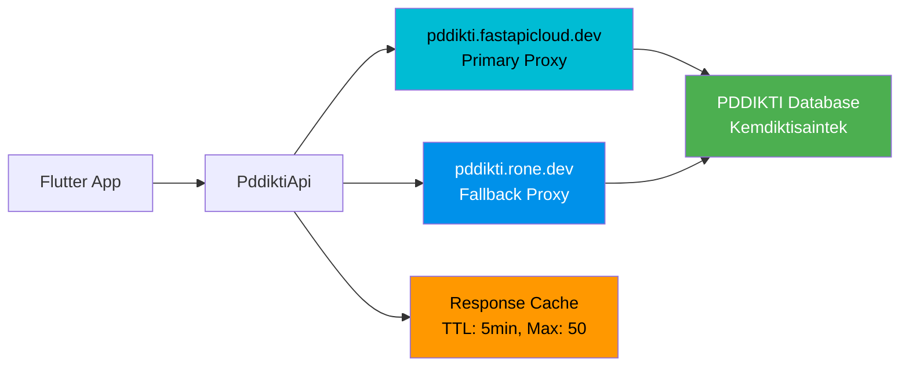
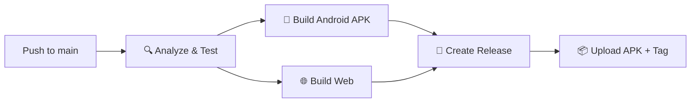

<p align="center">
  
</p>

<h1 align="center">🔓 DB Cracker v3.0</h1>

<p align="center">
  <strong>ctOS Faculty Database Scanner — Pencarian Data Pendidikan Indonesia</strong>
</p>

<p align="center">
  <a href="https://github.com/el-pablos/DB-Cracker/actions"></a>
  <a href="https://github.com/el-pablos/DB-Cracker/releases/latest"></a>
  
  
  
  
  
</p>

---

## 📖 Deskripsi

**DB Cracker** adalah aplikasi Flutter multi-platform (Android & Web) buat nyari data pendidikan tinggi Indonesia dari database PDDIKTI (Pangkalan Data Pendidikan Tinggi). App ini punya tema hacker ctOS (terinspirasi Watch Dogs) yang bikin experience pencarian data jadi lebih seru.

Fitur utama:
- 🔍 **Pencarian Mahasiswa** — cari berdasarkan nama, NIM, atau universitas
- 👨‍🏫 **Pencarian Dosen** — cari berdasarkan nama, NIDN, atau prodi
- 🏫 **Pencarian Perguruan Tinggi** — cari universitas/institut/politeknik
- 📚 **Pencarian Program Studi** — cari jurusan di seluruh Indonesia
- 📊 **Detail Lengkap** — profil mahasiswa, riwayat akademik, profil dosen, penelitian, pengabdian
- 🌐 **Multi-Source** — data dari beberapa sumber API sekaligus
- ⚡ **Response Caching** — pencarian berulang instant tanpa network call
- 🎨 **ctOS Hacker Theme** — UI gelap dengan efek terminal, animasi console, dan visual hacking

---

## 📱 Screenshots

### Home & Search

<p align="center">
  
  &nbsp;&nbsp;
  
  &nbsp;&nbsp;
  
</p>

<p align="center"><em>Home Screen • Search Results • Splash Screen</em></p>

### Detail Mahasiswa

<p align="center">
  
  &nbsp;&nbsp;
  
</p>

<p align="center"><em>Tab Profil • Tab Akademik</em></p>

### Pencarian & Detail Dosen

<p align="center">
  
  &nbsp;&nbsp;
  
  &nbsp;&nbsp;
  
</p>

<p align="center"><em>Search Dosen • Filter PT • Loading Animation</em></p>

<p align="center">
  
  &nbsp;&nbsp;
  
  &nbsp;&nbsp;
  
</p>

<p align="center"><em>Profil Dosen • Institusi • Riwayat Pendidikan & Mengajar</em></p>

<p align="center">
  
</p>

<p align="center"><em>Portfolio Penelitian Dosen</em></p>

---

## 🏗️ Arsitektur Projek

Projek ini menggunakan arsitektur **layered** dengan pemisahan concern yang jelas:

```
lib/
├── api/                    # Layer API & Network
│   ├── pddikti_api.dart       # Core API client (shared http.Client, caching, proxy)
│   ├── api_factory.dart        # Factory pattern (real API vs mock)
│   ├── multi_api_factory.dart  # Multi-source aggregator
│   └── api_services_integration.dart  # External API integration
├── models/                 # Data Models
│   ├── mahasiswa.dart         # Model Mahasiswa + Detail + Riwayat
│   ├── dosen.dart             # Model Dosen + Detail + Portofolio
│   ├── prodi.dart             # Model Program Studi
│   └── pt.dart                # Model Perguruan Tinggi
├── screens/                # UI Screens
│   ├── home_screen.dart       # Main search screen
│   ├── detail_screen.dart     # Mahasiswa detail (tabbed)
│   ├── dosen_detail_screen.dart    # Dosen detail + portofolio
│   ├── dosen_search_screen_new.dart # Dosen search (ctOS style)
│   ├── prodi_detail_screen.dart    # Detail program studi
│   ├── prodi_search_screen.dart    # Search prodi
│   └── pt_detail_screen.dart       # Detail perguruan tinggi
├── widgets/                # Reusable Widgets
│   ├── terminal_window.dart   # Terminal-style container
│   ├── hacker_search_bar.dart # Search bar dengan "HACK" button
│   ├── hacker_result_item.dart # Result card hacker style
│   ├── ctos_container.dart    # ctOS design system widgets
│   ├── filter_search_bar.dart # Filter universitas
│   └── ...                    # 10+ widget lainnya
├── services/               # Services
│   └── mock_pddikti_service.dart  # Mock data untuk testing
├── utils/                  # Utilities
│   ├── constants.dart         # Colors, strings, dimensions
│   ├── json_utils.dart        # Shared JSON parsing helpers
│   └── screen_utils.dart      # Responsive utilities
├── mixins/                 # Mixins
│   └── console_message_mixin.dart # Console animation mixin
└── main.dart               # App entry point + routing
```

### Design Patterns yang Dipake

| Pattern | Implementasi |
|---------|-------------|
| **Singleton** | `ApiFactory`, `MultiApiFactory`, `ApiServicesIntegration` |
| **Factory** | `ApiFactory` — switch antara real API dan mock |
| **Observer** | `WidgetsBindingObserver` — pause animation saat app di-background |
| **Strategy** | Multi-source search — parallel fetch dari berbagai API |
| **Cache** | In-memory response cache dengan TTL 5 menit, max 50 entries |

---

## 🔄 Flowchart Pencarian



---

## 🔌 API Architecture



### Endpoint Mapping

| Fungsi | Endpoint |
|--------|----------|
| Search Mahasiswa | `GET /api/search/mhs/{keyword}/` |
| Search Dosen | `GET /api/search/dosen/{keyword}/` |
| Search PT | `GET /api/search/pt/{keyword}/` |
| Search Prodi | `GET /api/search/prodi/{keyword}/` |
| Detail Mahasiswa | `GET /api/mhs/detail/{id}/` |
| Detail Dosen | `GET /api/dosen/profile/{id}/` |
| Detail PT | `GET /api/pt/detail/{id}/` |
| Detail Prodi | `GET /api/prodi/detail/{id}/` |
| Riwayat Studi Dosen | `GET /api/dosen/study-history/{id}/` |
| Riwayat Mengajar | `GET /api/dosen/teaching-history/{id}/` |
| Penelitian Dosen | `GET /api/dosen/penelitian/{id}/` |
| Pengabdian Dosen | `GET /api/dosen/pengabdian/{id}/` |

---

## ⚡ Performance Optimizations

Versi 3.0 udah di-overhaul total dari sisi performa:

| Optimisasi | Sebelum | Sesudah | Impact |
|-----------|---------|---------|--------|
| HTTP Client | New connection per request | Shared `http.Client` (keep-alive) | ~30% faster |
| Response Cache | Tidak ada | In-memory (5min TTL, 50 entries) | Instant repeat search |
| JSON Decode | Double decode di 6 methods | Single `_decodeResponse` | 50% less CPU |
| Dosen Profile | Sequential 3 endpoint (45s worst) | Single proxy endpoint (8s max) | 5x faster |
| List Extraction | 15x redundant double `is List` | Generic `_extractList` helper | Cleaner code |
| Data Fetch | 11x copy-paste methods | Generic `_fetchDosenList<T>` | -300 lines |
| Animation | Runs forever (battery drain) | Pause on background via Observer | Battery savings |
| Filter UI | 800ms blocking dialog | Instant setState | No UX delay |

---

## 🛠️ Tech Stack

| Teknologi | Versi | Fungsi |
|-----------|-------|--------|
| Flutter | 3.27.x | UI Framework |
| Dart | ≥3.7.0 | Programming Language |
| Provider | ^6.0.5 | State Management (DI) |
| http | ^0.13.5 | HTTP Client |
| url_launcher | ^6.1.11 | Open external URLs |
| intl | ^0.18.1 | Internationalization |

---

## 🚀 Installation & Setup

### Prerequisites
- Flutter SDK ≥3.7.0
- Dart SDK ≥3.7.0
- Android SDK (untuk build Android)
- Chrome (untuk build Web)

### Clone & Run

```bash
# Clone repo
git clone https://github.com/el-pablos/DB-Cracker.git
cd DB-Cracker

# Install dependencies
flutter pub get

# Run di Android device
flutter run -d <device-id>

# Run di Chrome (web)
flutter run -d chrome

# Build release APK
flutter build apk --release

# Build web
flutter build web --release
```

### Run Tests

```bash
# Unit tests
flutter test

# Analyze code
flutter analyze
```

---

## 🧪 Testing

Projek ini punya **99 unit tests** yang cover:

| Category | Tests | Coverage |
|----------|-------|----------|
| API Layer | 11 | Factory, singleton, integration |
| Models | 32 | JSON parsing, null safety, edge cases |
| Utils | 19 | Constants, JSON helpers |
| Widgets | 37 | Render, interaction, state |
| **Total** | **99** | **100% passed** ✅ |

```bash
$ flutter test
00:03 +99: All tests passed!
```

---

## 📋 CI/CD Pipeline

Setiap push ke `main` otomatis trigger:



- ✅ Auto analyze (lint + type check)
- ✅ Auto test (99 unit tests)
- ✅ Auto build APK + Web
- ✅ Auto create GitHub Release dengan changelog
- ✅ Auto version tagging dari `pubspec.yaml`

---

## 🔒 Security Notes

- Tidak ada API key atau secret yang di-hardcode
- Input user di-sanitize sebelum dikirim ke API
- Semua koneksi via HTTPS
- Response cache hanya di memory (tidak persist ke disk)
- `.gitignore` di-hardcode untuk block semua file sensitif

---

## 📊 Statistik Projek

| Metric | Value |
|--------|-------|
| Total Dart Files | 38 |
| Lines of Code (lib/) | ~5,700 |
| Unit Tests | 99 |
| Test Pass Rate | 100% |
| APK Size (release) | 46.7 MB |
| Min Android SDK | API 21 (Android 5.0) |
| Target Android SDK | API 34 (Android 14) |
| Flutter Analyze Issues | 0 errors, 0 warnings |

---

## 👨‍💻 Kontributor

<table>
  <tr>
    <td align="center">
      <a href="https://github.com/el-pablos">
        
        <br />
        <sub><b>Tama El Pablo</b></sub>
      </a>
      <br />
      <sub>Creator & Maintainer</sub>
    </td>
  </tr>
</table>

---

## 📄 License

Projek ini dibuat untuk keperluan edukasi dan riset. Data yang ditampilkan bersumber dari PDDIKTI (Pangkalan Data Pendidikan Tinggi) yang merupakan data publik.

---

## 🙏 Credits

- **PDDIKTI** — Sumber data pendidikan tinggi Indonesia
- **[ridwaanhall/api-pddikti](https://github.com/ridwaanhall/api-pddikti)** — Proxy API yang reliable
- **Flutter** — UI framework
- **Watch Dogs (Ubisoft)** — Inspirasi tema ctOS

---

<p align="center">
  <strong>Made with ☕ by <a href="https://github.com/el-pablos">Tamaengs</a></strong>
</p>

<p align="center">
  
  
</p>
