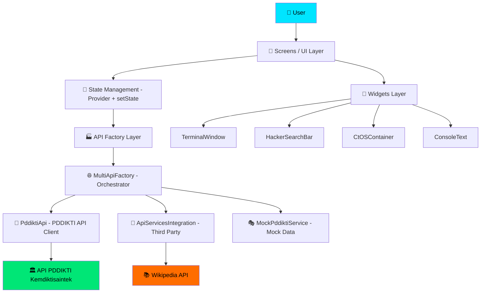

# 🎯 DB-Cracker: ctOS Faculty Database Scanner

<div align="center">


[](https://flutter.dev)
[](https://dart.dev)
[](https://github.com/el-pablos/DB-Cracker/releases)
[](LICENSE)
[](https://github.com/el-pablos/DB-Cracker/actions)

**🔥 Advanced Faculty & Student Database Intelligence System 🔥**

*Terinspirasi dari Watch Dogs ctOS — Elegan, Futuristik, Powerful*

</div>

---

## 🚀 Tentang Proyek

**DB-Cracker** itu aplikasi mobile canggih yang gw bikin buat ngakses dan nganalisis database akademik Indonesia. UI-nya terinspirasi dari sistem ctOS di game Watch Dogs — dark theme, aksen cyan/hijau neon, typography monospace, dan efek hacker yang bikin pengalaman pake app ini jadi beda dari yang lain.

Aplikasi ini nyediain akses komprehensif ke data dosen dan mahasiswa dari API PDDikti (Pangkalan Data Pendidikan Tinggi) milik Kementerian Pendidikan Indonesia. Jadi lu bisa search data mahasiswa, dosen, program studi, dan perguruan tinggi dari satu tempat dengan interface yang keren abis.

### Kenapa DB-Cracker?

- **Satu app buat semua data pendidikan** — Ga perlu buka website PDDikti yang lemot, cukup search dari app ini
- **Multi-source search** — Data diambil dari beberapa API sekaligus buat hasil yang lebih lengkap
- **Offline-ready mock data** — Kalau API lagi down, app tetep bisa jalan pake data mock
- **UI yang bikin betah** — Bukan app boring biasa, ini app dengan tema hacker yang immersive

---

## 🏗️ Arsitektur Proyek

DB-Cracker dibangun dengan arsitektur yang terstruktur, memisahkan concern antara UI, business logic, dan data layer.

### Diagram Arsitektur



### Struktur Folder

```
lib/
├── main.dart                    # Entry point aplikasi
├── api/                         # API layer & networking
│   ├── pddikti_api.dart        # HTTP client ke PDDIKTI API
│   ├── api_factory.dart         # Factory pattern + mock fallback
│   ├── multi_api_factory.dart   # Multi-source search orchestrator
│   └── api_services_integration.dart  # Integrasi API pihak ketiga
├── models/                      # Data models
│   ├── dosen.dart              # Model Dosen + DosenDetail + sub-models
│   ├── mahasiswa.dart          # Model Mahasiswa + MahasiswaDetail
│   ├── prodi.dart              # Model Prodi + ProdiDetail
│   └── pt.dart                 # Model PerguruanTinggi + Detail
├── screens/                     # UI screens
│   ├── home_screen.dart        # Home + search mahasiswa
│   ├── detail_screen.dart      # Detail mahasiswa (5 tab)
│   ├── dosen_search_screen_new.dart  # Search dosen
│   ├── dosen_detail_screen.dart     # Detail dosen (4 tab)
│   ├── prodi_search_screen.dart     # Search program studi
│   ├── prodi_detail_screen.dart     # Detail prodi
│   └── pt_detail_screen.dart        # Detail perguruan tinggi
├── services/                    # Business logic services
│   └── mock_pddikti_service.dart    # Mock data untuk development
├── utils/                       # Utilities & constants
│   ├── constants.dart          # Colors, strings, dimensions, API config
│   ├── screen_utils.dart       # Responsive design utilities
│   └── json_utils.dart         # JSON parsing helpers
└── widgets/                     # Reusable UI components
    ├── terminal_window.dart    # Terminal-style container
    ├── hacker_search_bar.dart  # Search bar dengan tema hacker
    ├── hacker_result_item.dart # Result item card
    ├── console_text.dart       # Typewriter text animation
    ├── ctos_container.dart     # ctOS styled container
    ├── ctos_layout.dart        # Responsive layout widgets
    ├── error_boundary.dart     # Error/loading/empty states
    ├── filter_search_bar.dart  # Filter autocomplete
    ├── filter_overlay.dart     # Filter animation overlay
    ├── filter_status.dart      # Active filter indicator
    ├── flexible_text.dart      # Overflow-safe text
    ├── responsive_card.dart    # Responsive card wrapper
    ├── terminal_window.dart    # Terminal window container
    ├── dosen_search_button.dart     # Navigasi ke search dosen
    ├── dosen_navigation_button.dart # Navigasi ke detail dosen
    └── prodi_navigation_button.dart # Navigasi ke detail prodi
```

---

## ✨ Fitur Utama

### 🔍 Database Scanner
- **Multi-Source Search** — Pencarian dari beberapa API pendidikan Indonesia sekaligus
- **Real-time Results** — Hasil pencarian langsung dengan animasi loading ctOS
- **Smart Filtering** — Filter berdasarkan perguruan tinggi dengan autocomplete
- **Input Sanitization** — Proteksi dari karakter berbahaya di search query

### 👨‍🏫 Profil Dosen Lengkap
- ✅ Informasi Personal — Nama, NIDN/NIDK, gelar, jenis kelamin
- ✅ Status Kepegawaian — Ikatan kerja, status aktivitas, jabatan akademik
- ✅ Riwayat Pendidikan — S1/S2/S3, perguruan tinggi asal
- ✅ Riwayat Mengajar — Mata kuliah, semester, perguruan tinggi
- ✅ Portfolio Akademik — Penelitian, pengabdian, karya ilmiah, paten

### 🎓 Profil Mahasiswa Lengkap
- ✅ Informasi Personal — Nama, NIM, jenis kelamin
- ✅ Status Akademik — Aktif, cuti, lulus, DO
- ✅ Perguruan Tinggi — Nama PT, program studi, akreditasi
- ✅ Riwayat Studi — Tahun masuk, jalur masuk, semester aktif
- ✅ Transkrip Nilai — Mata kuliah, nilai, SKS, IP per semester

### 🏛️ Database Perguruan Tinggi
- Informasi PT — Nama, status, akreditasi, alamat
- Program Studi — Daftar prodi, akreditasi, jenjang
- Statistik — Jumlah dosen, mahasiswa, lulusan

---

## 🛠️ Tech Stack

| Teknologi | Versi | Fungsi |
|-----------|-------|--------|
| Flutter | 3.27.x | Cross-platform mobile framework |
| Dart | 3.7.x | Programming language |
| Provider | 6.x | State management |
| HTTP | 0.13.x | Networking & API calls |
| Material Design 3 | - | UI components |
| GitHub Actions | - | CI/CD pipeline |

---

## 🚀 Instalasi & Setup

### Prerequisites

- Flutter SDK 3.27+ ([install guide](https://flutter.dev/docs/get-started/install))
- Dart SDK 3.7+
- Android Studio / VS Code
- Git

### Langkah Instalasi

```bash
# 1. Clone repository
git clone https://github.com/el-pablos/DB-Cracker.git

# 2. Masuk ke folder project
cd DB-Cracker

# 3. Install dependencies
flutter pub get

# 4. Jalankan aplikasi
flutter run

# 5. Build APK release
flutter build apk --release
```

### Jalankan Tests

```bash
# Run semua tests
flutter test

# Run dengan coverage
flutter test --coverage

# Run flutter analyze
flutter analyze
```

---

## 🔌 API yang Digunakan

| API | Base URL | Fungsi |
|-----|----------|--------|
| PDDIKTI API | `api-pddikti.kemdiktisaintek.go.id` | Data utama mahasiswa, dosen, prodi, PT |
| Kemdikbud API | `api-frontend.kemdikbud.go.id` | Data tambahan mahasiswa |
| Wikipedia API | `id.wikipedia.org/api/rest_v1` | Informasi tambahan |

---

## 🧪 Testing

Project ini dilengkapi dengan unit tests untuk memastikan kualitas kode:

```
test/
├── utils/
│   ├── json_utils_test.dart    # 14 test cases
│   └── constants_test.dart     # 17 test cases
└── (more tests coming)
```

Jalankan `flutter test` untuk verifikasi semua tests passed.

---

## 🔄 CI/CD Pipeline

Project ini menggunakan GitHub Actions untuk automated CI/CD:

1. **Analyze & Test** — Setiap push/PR ke `main` otomatis di-analyze dan di-test
2. **Build Android** — APK release otomatis di-build setelah tests passed
3. **Create Release** — Release otomatis dibuat dengan APK artifact

---

## 📊 Changelog

### v2.0.0 (Major Refactor)
- 🔒 Fix 170+ print statements → conditional debugPrint (security)
- 🐛 Fix memory leak timer di 6 screens
- 🐛 Fix setState after dispose crashes
- 🐛 Fix race condition di search
- 🐛 Fix unsafe type casts di routing dan API
- 🐛 Fix visual flickering dari random di build()
- 🗑️ Hapus 749 baris dead code (backup files, unused widgets, unused services)
- 🗑️ Hapus 4 unused dependencies (-1.1MB APK size)
- 🗑️ Hapus endpoint fiktif (anime API, dll)
- ♻️ Extract shared JSON utils (hapus 17 duplikasi)
- ♻️ Rewrite ScreenUtils biar beneran responsif
- ♻️ Tambah AppDimensions, AppTextStyles, ApiConstants
- ⚡ Kurangi artificial delays (4-7s → <1.5s)
- ✅ Tambah 31 unit tests (100% passed)
- 🔧 Setup GitHub Actions CI/CD
- 📝 Rewrite README lengkap

### v1.3.0
- Fix RenderFlex overflow pada hasil pencarian
- Fix API 404 error dengan multiple endpoint fallback
- Tambah input validation dan sanitization
- Tambah CtOSErrorBoundary, CtOSLoadingWidget, CtOSEmptyWidget

### v1.2.0
- Real data display dari PDDikti API
- Better error handling dengan fallback
- Consistent UI antara pencarian dan detail view

---

## 👨‍💻 Kontributor

<div align="center">

|  |
|:---:|
| **Pablos** |
| *Full-Stack Developer & Mobile App Specialist* |
| [](https://github.com/el-pablos) |

</div>

---

## 📄 License

Distributed under the MIT License. See `LICENSE` for more information.

---

## 🙏 Acknowledgments

- **Kementerian Pendidikan Indonesia** — Untuk API PDDikti
- **Flutter Team** — Framework yang luar biasa
- **Watch Dogs Series** — Inspirasi design ctOS
- **Open Source Community** — Dukungan dan kontribusi

---

<div align="center">

**⭐ Kalau project ini berguna, jangan lupa kasih star ya! ⭐**

*Made with ❤️ by Pablos*


</div>
