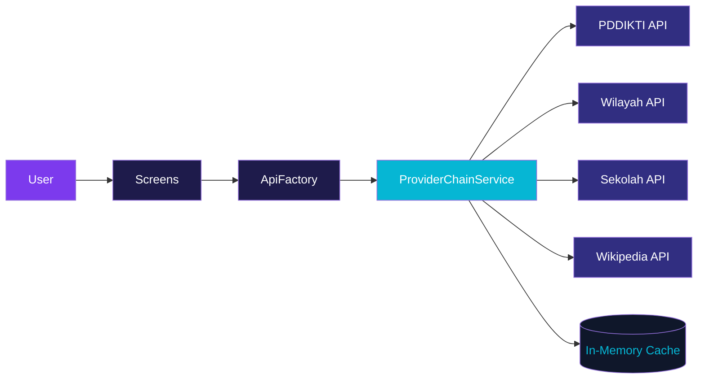

<p align="center">
  
</p>

<h1 align="center">DB Cracker v2.0</h1>

<p align="center">
  <strong>Neo-Violet Academic — Pencarian Data Pendidikan Tinggi Indonesia</strong>
</p>

<p align="center">
  <a href="https://github.com/el-pablos/DB-Cracker/actions/workflows/ci.yml"></a>
  
  
  
  
</p>

---

## Tentang

**DB Cracker** adalah aplikasi Flutter buat nyari data pendidikan tinggi Indonesia — mahasiswa, dosen, program studi, dan perguruan tinggi. Data diambil dari PDDIKTI API dan beberapa sumber publik lainnya, tanpa perlu API key atau autentikasi.

Versi 2.0 hadir dengan desain baru **Neo-Violet Academic** — tampilan akademik modern dengan palet violet-cyan di atas deep navy background. Goodbye ctOS hacker theme, hello clean academic aesthetic.

---

## Screenshots

<p align="center">
  
  &nbsp;&nbsp;
  
  &nbsp;&nbsp;
  
</p>

<p align="center"><em>Splash • Home • Search Results</em></p>

> Screenshots di atas mungkin belum reflect desain v2.0. Update segera menyusul di `assets/screenshots/`.

---

## Tech Stack

| Layer | Teknologi | Keterangan |
|-------|-----------|------------|
| Framework | Flutter 3.27 | Multi-platform (Android & Web) |
| Language | Dart 3.6+ | Null safety, pattern matching |
| State Management | Provider 6.x | Lightweight, tree-based DI |
| Networking | http 0.13 | Shared client, retry logic |
| Typography | Inter | Body text — clean sans-serif |
| Monospace | JetBrains Mono | Data display, kode, ID fields |
| Internationalization | intl 0.18 | Format tanggal & angka |

---

## Arsitektur

Arsitektur layered dengan **Provider Chain** — kalau satu sumber data gagal, otomatis fallback ke provider berikutnya.



```
lib/
├── api/              # Network layer, factory, provider chain
├── models/           # Data models (Mahasiswa, Dosen, PT, Prodi)
├── screens/          # UI screens & pages
├── widgets/          # Reusable components
├── services/         # Cache, health monitor, enrichment
└── utils/            # Constants, helpers, theme
```

---

## Design System

**Neo-Violet Academic** — desain v2.0 yang menggantikan ctOS hacker theme.

| Token | Nilai | Penggunaan |
|-------|-------|------------|
| Primary | `#7C3AED` (Violet 600) | Buttons, active states, accent |
| Secondary | `#06B6D4` (Cyan 500) | Links, badges, data highlights |
| Background | `#0F172A` (Slate 900) | Deep navy base |
| Surface | `#1E1B4B` (Indigo 950) | Cards, containers |
| On-Surface | `#F8FAFC` (Slate 50) | Text utama |
| Muted | `#94A3B8` (Slate 400) | Secondary text, captions |

**Prinsip desain:**
- Clean & readable — prioritas pada keterbacaan data
- Kontras tinggi — violet/cyan di atas navy gelap
- Tipografi dual — Inter untuk body, JetBrains Mono untuk data
- Spacing konsisten — 8px grid system

---

## Fitur

- **Pencarian Mahasiswa** — cari berdasarkan nama, NIM, atau universitas
- **Pencarian Dosen** — cari berdasarkan nama, NIDN, atau program studi
- **Pencarian Program Studi** — cari jurusan di seluruh Indonesia
- **Pencarian Perguruan Tinggi** — universitas, institut, politeknik, akademi
- **Multi-Source API + Failover** — provider chain dengan fallback otomatis
- **In-Memory Cache + TTL** — fresh cache instant, stale cache sebagai fallback offline
- **Health Monitoring** — dashboard status semua provider, latency, cache stats
- **Responsive Design** — adaptif di berbagai ukuran layar
- **Enrichment Links** — tautan langsung ke GARUDA, RAMA, SINTA
- **Wikipedia Summary** — ringkasan PT/wilayah dari Wikipedia Indonesia
- **Zero Auth** — semua fitur core jalan tanpa API key

---

## Instalasi

```bash
# Clone repo
git clone https://github.com/el-pablos/DB-Cracker.git
cd DB-Cracker

# Install dependencies
flutter pub get

# Jalankan di device/emulator
flutter run

# Build release APK
flutter build apk --release --split-per-abi

# Build web
flutter build web --release
```

**Requirements:**
- Flutter SDK 3.27+
- Dart SDK 3.6+
- Android SDK (untuk build Android)
- Chrome (untuk build Web)

---

## Testing

Projek ini punya **184 unit tests** yang cover seluruh modul. Semua test pake mock HTTP client — deterministic, bisa jalan di CI tanpa internet.

```bash
# Jalankan semua test
flutter test

# Output:
# 00:07 +184: All tests passed!

# Static analysis
flutter analyze --fatal-infos

# Format check
dart format --set-exit-if-changed .
```

| Kategori | Tests | Cakupan |
|----------|-------|---------|
| Provider Chain | 10 | Fallback, timeout, cache, disabled provider |
| Cache Store | 10 | Fresh, stale, expired, eviction, TTL |
| Models | 48 | JSON parsing, null safety, edge cases |
| Widgets | 37 | Render, interaction, state |
| Services | 47 | Wilayah, Sekolah, Health, Wikipedia, KBBI |
| Utils | 14 | Constants, helpers |
| External Links | 8 | URL encoding, link builders |
| DataResult | 5 | Live, cached, stale, sourceLabel |
| Registry | 5 | Provider lookup, uniqueness |

---

## CI/CD

Pipeline otomatis via GitHub Actions (`.github/workflows/ci.yml`):

1. **Analyze & Test** — `flutter analyze` + `flutter test` + format check
2. **Build Android** — APK release split per ABI
3. **Build Web** — deploy-ready web build
4. **Release** — auto-create GitHub Release saat push tag `v*`

Trigger:
- Push ke `main` / `develop` → analyze + test
- Push tag `v*` → full build + release
- Pull request ke `main` → analyze + test

---

## Contributing

Contributions welcome. Fork, buat branch, submit PR.

**Format commit:**

```
type: deskripsi singkat (1 line, bahasa Indonesia kasual)
```

Types: `add`, `fix`, `update`, `remove`, `refactor`, `docs`, `test`, `chore`

Contoh:
```
add: implementasi search filter di halaman dosen
fix: benerin cache TTL yang ga expired
update: improve loading state di detail mahasiswa
refactor: pisahin logic provider chain ke service sendiri
```

**Sebelum submit PR:**
```bash
flutter analyze --fatal-infos
flutter test
dart format .
```

---

## License

MIT License — lihat [LICENSE](LICENSE) untuk detail.

---

<p align="center">
  <strong>Built with Flutter by <a href="https://github.com/el-pablos">Tamaengs</a></strong>
</p>
